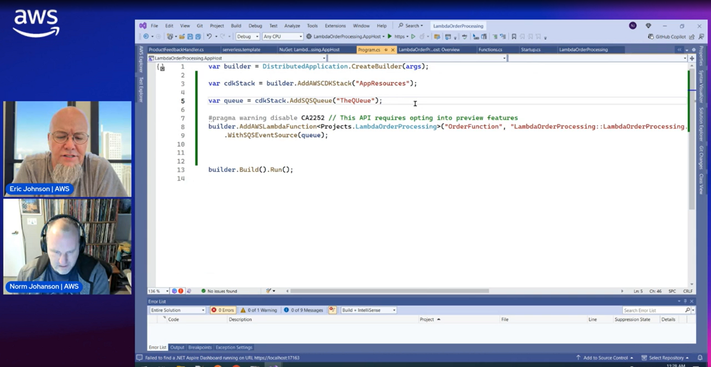

## AWS Lambda Integrations with .NET Aspire (AWS Serverless Office Hours) 

The repository contains the code that was used in the April 8th, 2025 AWS Serverless Office Hours show demonstrating AWS Lambda integrations with .NET Aspire.

The talk contained 2 demos solutions that can be found in the repository.

## LambdaOrderProcessing

This demo defines a single Lambda function that reads message from an SQS queue and does sentiment. The Lambda function can be tested through either the Lambda test tool UI exposed from the Aspire dashboard or by hooking the function up to a real SQS queue and defining the SQS event source with the WithSQSEventSource.

Different then what was shared in the live showing the TestPublisher in the solution has been added to the AppHost using the SQS queue
created by the CDK in the AppHost. The TestPublisher will run continuously adding a new message to the queue every 5 seconds.

## ServerlessAccountManagement

This demo defined a REST API implemented by the ServerlessAccountManagement Lambda project. The Aspire AppHost takes care of 
configuring Amazon DynamoDB local and Redis cache instance. It also uses the API Gateway emulator to test the Lambda functions as a 
REST API that can be accessed through any HTTP REST testing tool.

